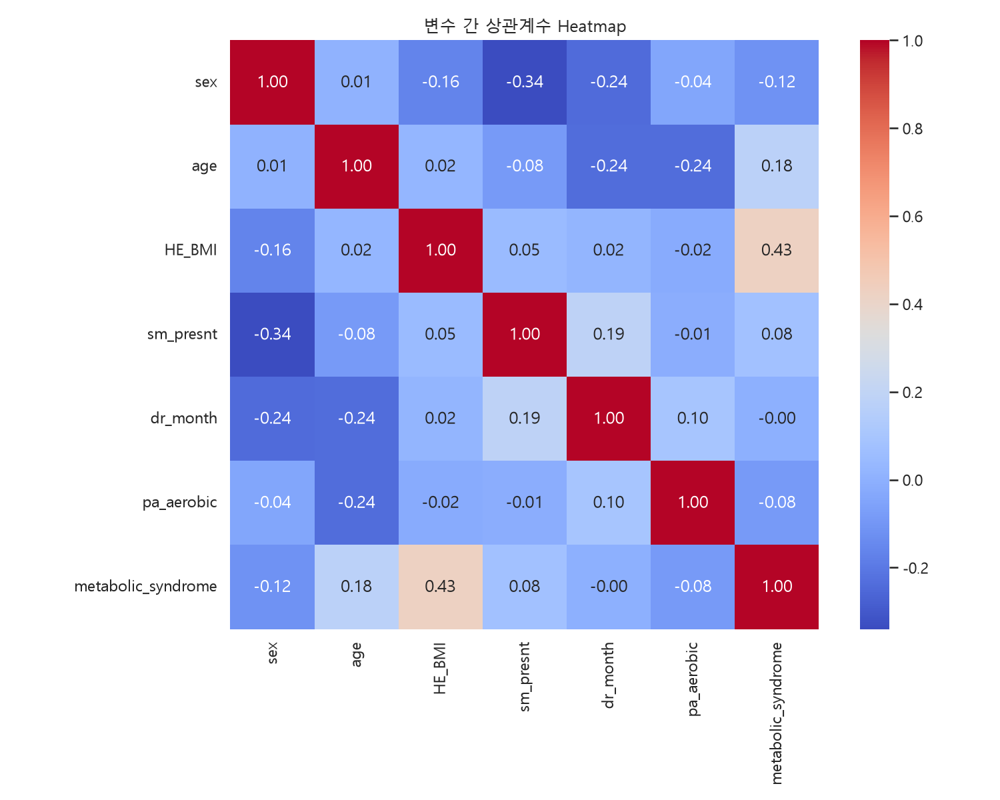
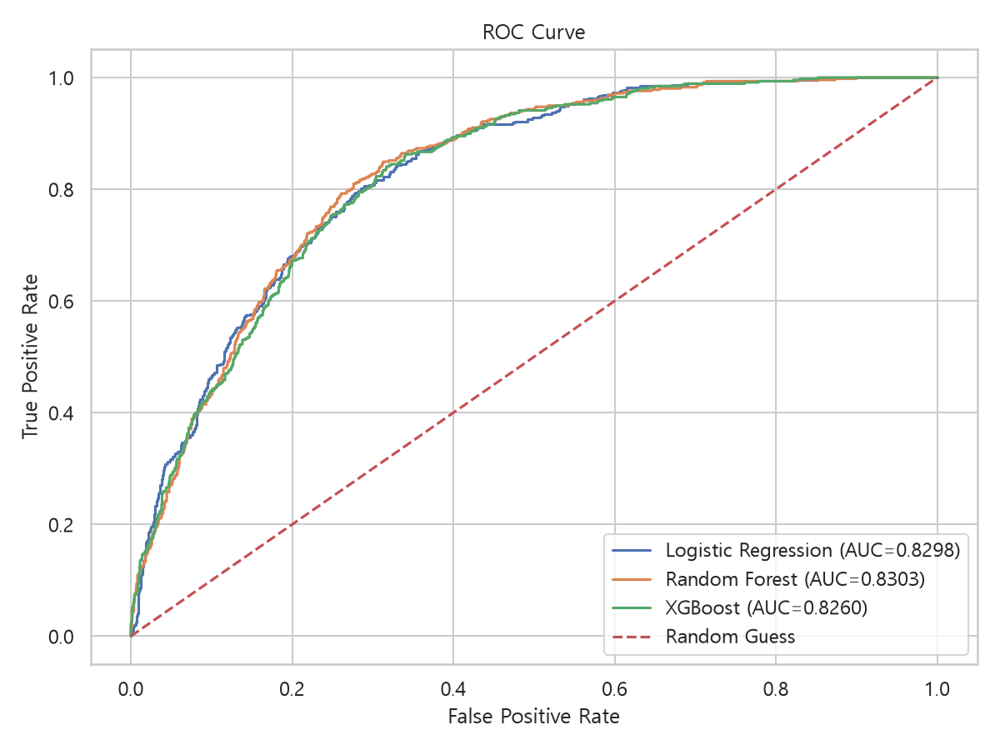
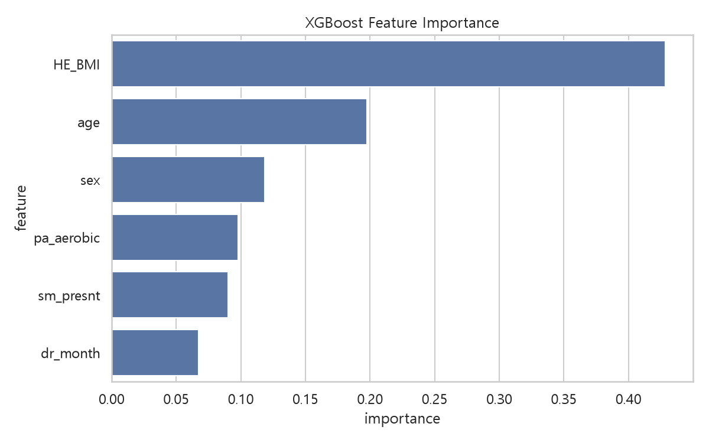
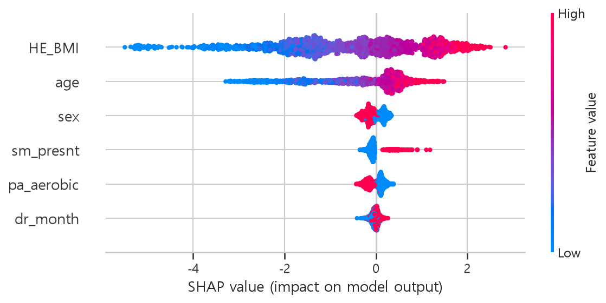
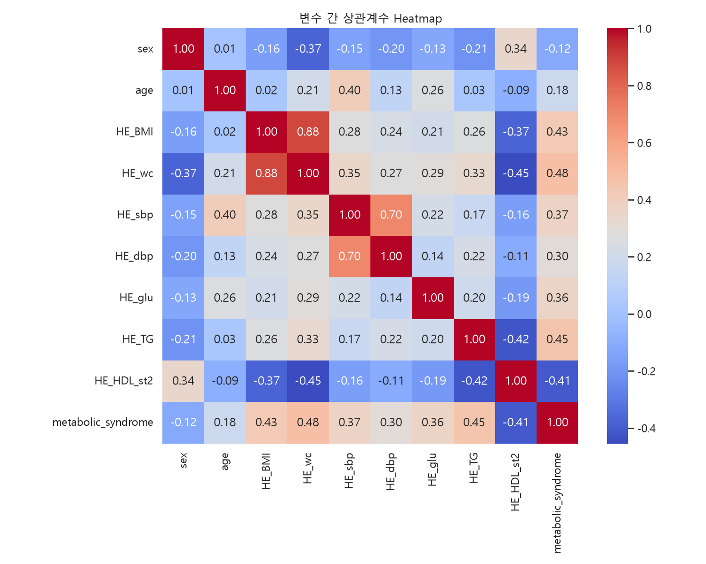
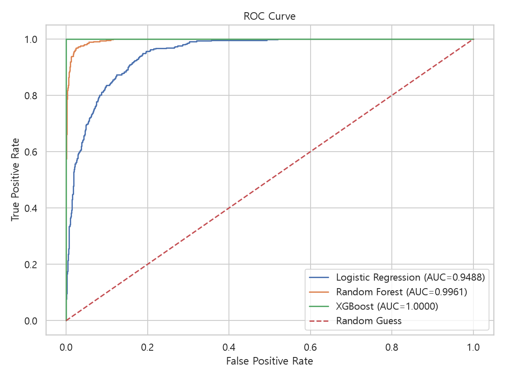
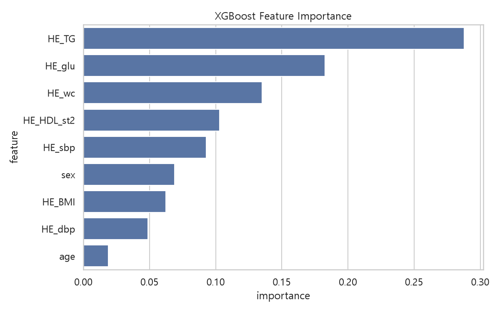

# 대사증후군 위험군 예측 프로젝트

국민건강영양조사(KNHANES) 2023~2024 데이터를 활용하여 대사증후군(Metabolic Syndrome) 위험군을 예측하고 주요 위험 요인을 분석한 머신러닝 프로젝트입니다.

---

## 프로젝트 개요

대사증후군은 심혈관질환, 당뇨병, 뇌혈관질환의 주요 위험 인자로 알려져 있습니다.

본 프로젝트에서는 국민건강영양조사 데이터를 활용하여 다음 두 가지 관점에서 위험군을 예측하였습니다.

### 생활습관 기반 조기 예측

건강검진 결과 없이도 확보 가능한 정보를 활용하여 대사증후군 위험군을 선별

* 성별
* 나이
* BMI
* 흡연 여부
* 음주 여부
* 유산소 운동 여부

### 건강검진 기반 고정밀 예측

건강검진 수치를 활용한 고정밀 위험 예측

* BMI
* 허리둘레
* 혈압
* 공복혈당
* 중성지방
* HDL 콜레스테롤

---

## 데이터셋

### 국민건강영양조사 (KNHANES)

* 2023년 국민건강영양조사
* 2024년 국민건강영양조사

분석 대상

* 총 10,162명

대사증후군 비율

| 구분  |     인원 |
| --- | -----: |
| 정상군 |  7,875 |
| 위험군 |  2,287 |
| 전체  | 10,162 |

---

# 생활습관 기반 모델

## 분석 프로세스

* EDA
* 카이제곱 검정
* Logistic Regression
* Random Forest
* XGBoost
* ROC Curve
* 5-Fold Cross Validation
* SHAP

---

## 상관관계 분석



---

## ROC Curve



---

## XGBoost Feature Importance



---

## SHAP Summary



---

# 건강검진 기반 모델

## 분석 프로세스

* EDA
* Logistic Regression
* Random Forest
* XGBoost
* ROC Curve

---

## 상관관계 분석



---

## ROC Curve



---

## XGBoost Feature Importance



---

# 사용 모델

| 모델                  | 목적           |
| ------------------- | ------------ |
| Logistic Regression | 해석 가능한 기준 모델 |
| Random Forest       | 비선형 패턴 학습    |
| XGBoost             | 최종 성능 비교     |

---

# 사용 기술

## Data Analysis

* Pandas
* NumPy
* SciPy

## Visualization

* Matplotlib
* Seaborn

## Machine Learning

* Scikit-Learn
* XGBoost
* SHAP

---

# 프로젝트 구조

```text
minipjt_Metabolic_check
│
├─ docs/
│   ├─ life_style/
│   └─ with_HE/
│
├─ metabolic_model.py
├─ metabolic_model_with_HE.py
│
├─ requirements.txt
├─ .gitignore
└─ README.md
```

---

# 주요 인사이트

### 생활습관 기반 모델

* BMI가 가장 중요한 위험 요인으로 나타남
* 연령 증가에 따라 위험도가 증가
* 흡연자는 비흡연자보다 위험도가 높게 나타남
* 유산소 운동은 위험도를 감소시키는 방향으로 작용

### 건강검진 기반 모델

* 허리둘레
* 공복혈당
* 중성지방

이 대사증후군 판별에 가장 큰 영향을 미치는 변수로 확인됨

---

# 한계점

* 국민건강영양조사 단면 데이터 활용
* 건강검진 기반 모델은 일부 변수와 라벨 생성 기준이 중복되어 데이터 누수 가능성 존재
* 시계열 분석 불가

---

# 향후 개선 방향

* SMOTE 기반 불균형 데이터 처리
* Hyperparameter Tuning
* LightGBM 비교
* 웹 기반 대시보드 구축
* 의료 데이터 기반 위험도 예측 서비스 확장

```
```
